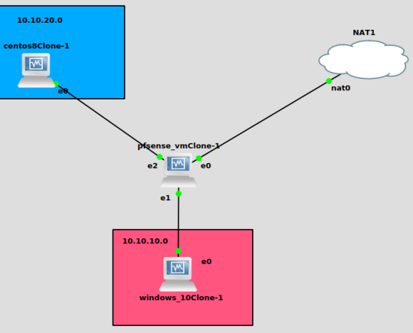
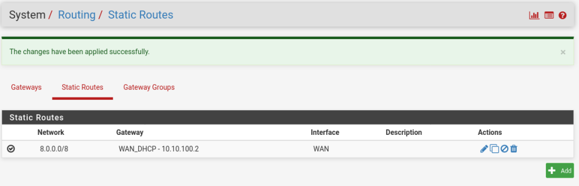
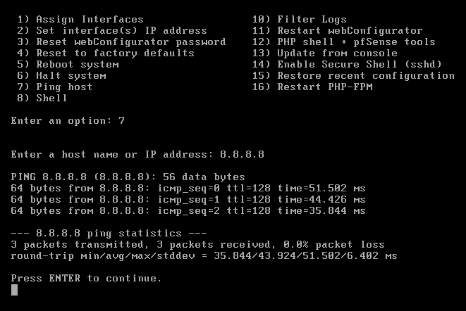

# TP2-BootCamp

[I. Présentation du sujet & matériel](#Présentation-du-sujet-&-matériel)  
[II. Configuration réseau](#Configuration-réseau)  
[III. Configuration des règles sur PfSense](#Configuration-des-règles-sur-PfSense)  
[IV. Configuration du WAN sur PfSense](#Configaration-du-WAN-sur-PfSense)  
[V. Configuration du VPN sur PfSense](#Configuration-du-VPN-sur-PfSense)  
[VI. Optimisation de l'accès au traffic sur PfSense](#Optimisation-de-l’accès-au-traffic-sur-PfSense)  

## Présentation du sujet & matériel
  
→ 1 x VM PfSense  
→ 1 x VM CentOS minimale  
→ 1 x VM Windows 10 Client  
→ 3 x Réseaux Host Only  
→ 1 x Réseau NAT  
→ 1 x Réseau de management (Host Only ou Bridge) sert à administrer les VMs depuis le PC

## Configuration réseau
* Chaque VM doit avoir une IP et pouvoir `Pinger` le PFSense:  

VM | IP  
--- | ---
Windows | 10.10.10.10  
CENTOS (projet linux) | 10.10.20.20 


* Les VMs ne doivent pas se pinger entre elles ni sortir sur Internet sans passer par le PFSense:  
    * Pour la VM CentOS: 
    ```bash
    [centos8@localhost ~]$ ping 10.10.10.10
    connect: Network is unreachable
    ```
    * Pour la VM Windows:
    ```bash
    PS C:\Users\windows> ping 10.10.20.20

    Envoi d'une requête 'Ping'  10.10.20.20 avec 32 octets de données :
    Délai d'attente de la demande dépassé.
    ```
* Le PFSense doit avoir accès à Internet par le réseau INTERNET (NAT):  


* Le PFSense doit servir de serveur DHCP aux réseaux Host Only:  
```bash
```
* Le PFSense doit router les réseaux Host Only entre eux et les réseaux Host Only vers Internet:  
```bash
```
## Configuration des règles sur PfSense
* Le CentOS doit pouvoir Pinger n’importe quelle VM:  
```bash
```
* Le Windows doit pouvoir surfer sur internet (sauf sur les sites pour adultes):  
```bash
```
* Le Windows doit pouvoir contacter votre Projet Linux:  
```bash
```
## Configuration du WAN sur PfSense  
* Configurer un NAT Static pour que chaque sous réseaux Host Only utilisent une adresse du réseau Internet différente (S-NAT):  
```bash
```
* Configurer un D-NAT pour publier votre projet Linux depuis le réseau Internet (Si pas de projet Linux, publier la page d’accueil d’un serveur Nginx ou Apache en port 80 et/ou 443):  
```bash
```
## Configuration du VPN sur PfSense
* Configurez un VPN IPSec et interconnectez deux PFSense (le votre et celui de votre binome) soit avec un Bridge soit en 4G avec votre téléphone sur le réseau NAT de votre PFSense:  
```bash
```
* Configurer un VPN SSL avec un client OpenVPN afin d’avoir accès à l’administration de votre Projet Linux et à votre VM Windows depuis votre PC ou même Internet:  
```bash
```
## Optimisation de l’accès au traffic sur PfSense
Configurer un Traffic Shapper (limitation de bande passante) sur le réseau CentOS à destination des autres réseau, avec une Bande Passante max de 200ko/s:  
```bash
```